# Hi, I'm Can Gökçeaslan 👋

### Entrepreneur · CTO · Software Educator

I build software products, launch technology ventures, and share what I learn through practical developer education. I currently lead product and engineering at [GoodTech.](https://www.goodtechproducts.com), where we design and develop AI-native digital experiences.

 

### At a Glance

<table>
  <tr>
    <td width="50%" valign="top">
      <strong>🎓 45K+ Students</strong>
      
Practical software development education built around real-world workflows.

    </td>
    <td width="50%" valign="top">
      <strong>🚀 20+ Digital Products</strong>
      
Delivered across web, mobile, cloud, and AI from strategy through launch.

    </td>
  </tr>
  <tr>
    <td width="50%" valign="top">
      <strong>🤝 Co-founder Experience</strong>
      
Turning early-stage ideas into funded, market-ready technology ventures.

    </td>
    <td width="50%" valign="top">
      <strong>🧭 CTO Leadership</strong>
      
Leading product strategy, engineering, remote teams, and technical delivery.

    </td>
  </tr>
</table>

### What I Do

- **🚀 Build products** — Turn ideas into scalable, AI-native digital products from strategy through delivery.
- **🧭 Lead teams** — Guide remote engineering teams and connect product decisions with business goals.
- **🎓 Teach developers** — Create practical courses on JavaScript, Node.js, Redis, GitHub, and payment systems.

### Core Technologies

#### Languages

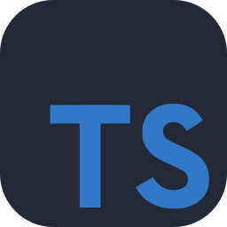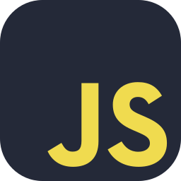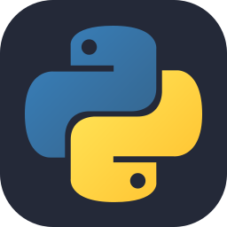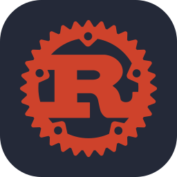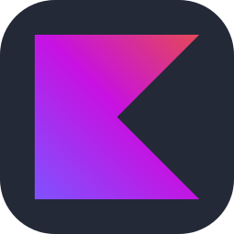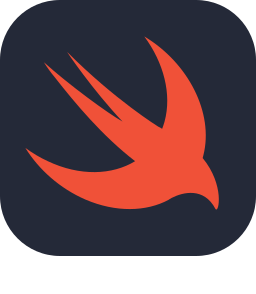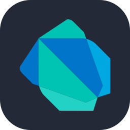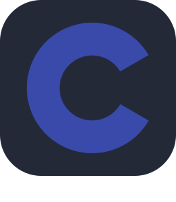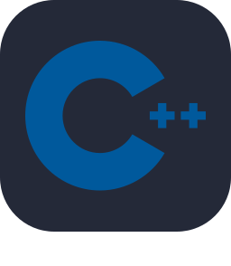 

#### Web

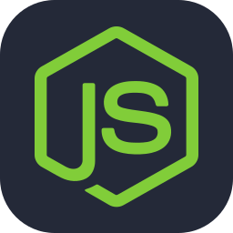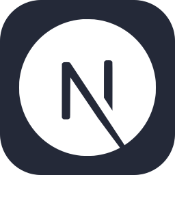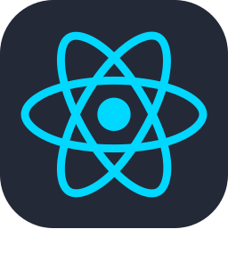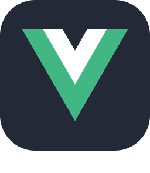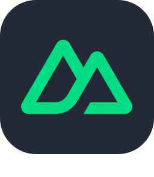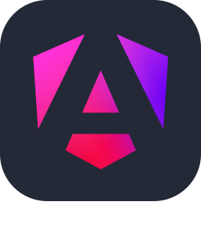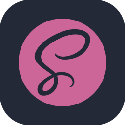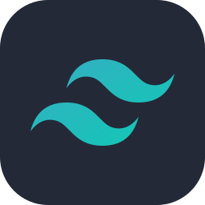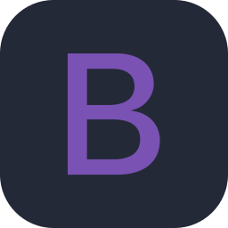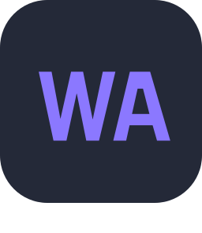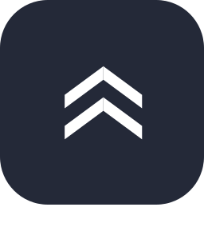 

#### Mobile

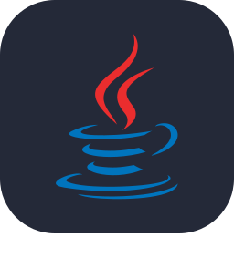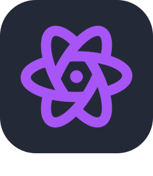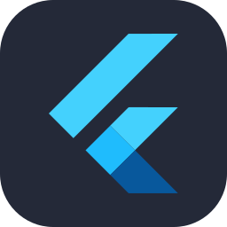 

#### Database

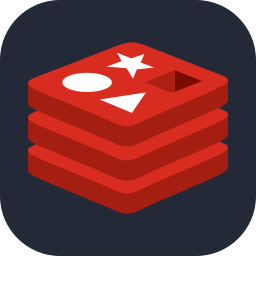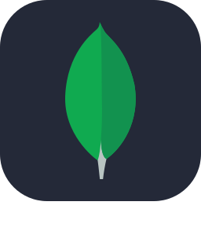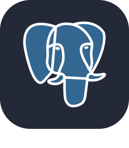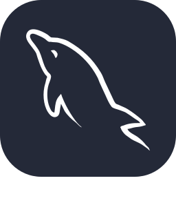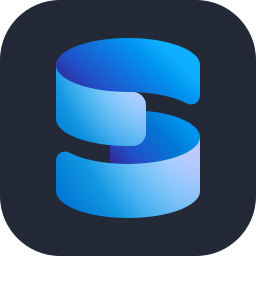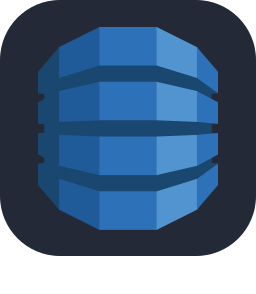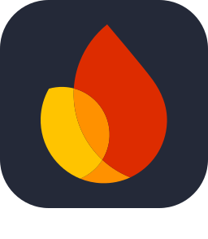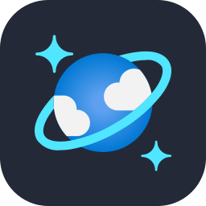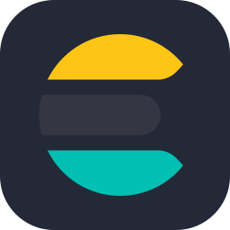 

#### Infrastructure

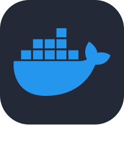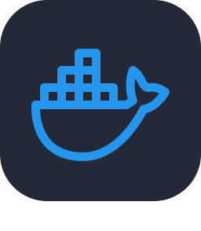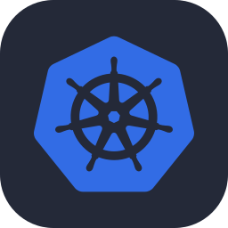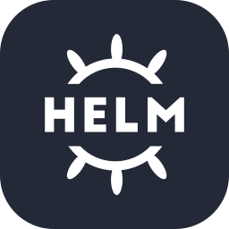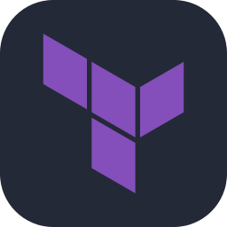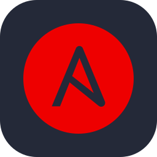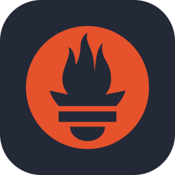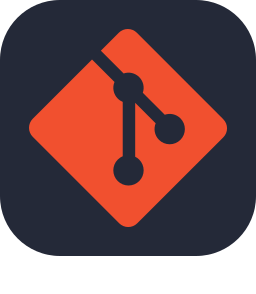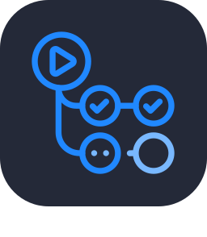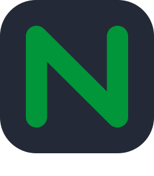 

#### Cloud Platforms

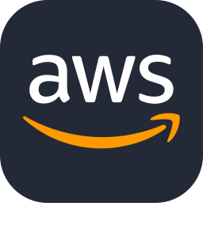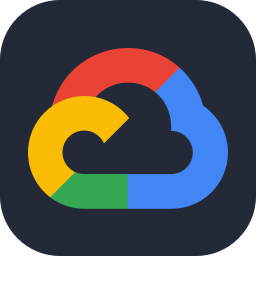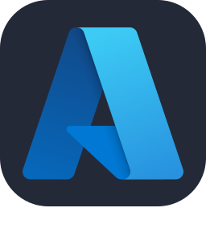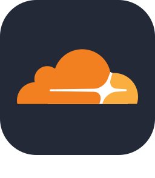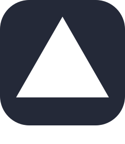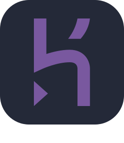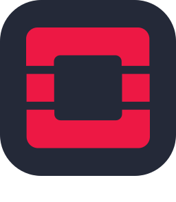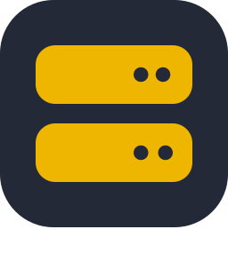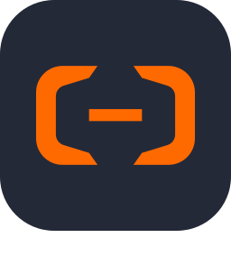 

#### AI Development

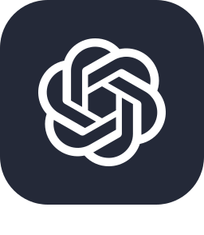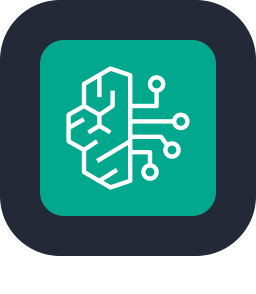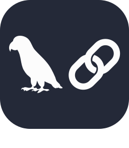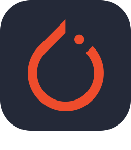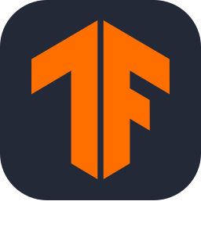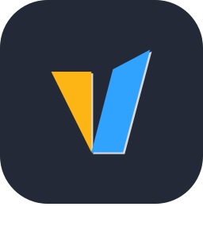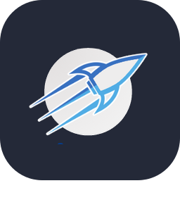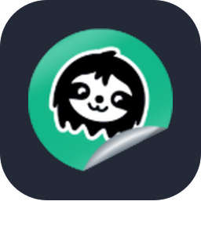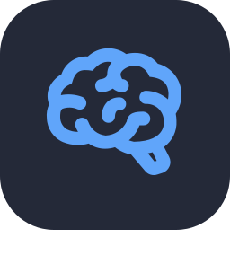 

#### AI Toolkit

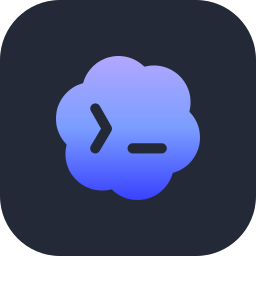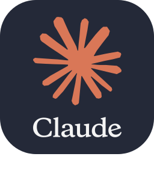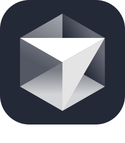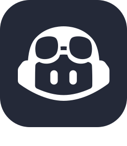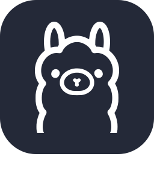 

### GitHub Insights

<a href="https://github.com/Ashutosh00710/github-readme-activity-graph">
  <picture>
    <source media="(prefers-color-scheme: dark)" srcset="https://github-readme-activity-graph.vercel.app/graph?username=cangokceaslan&amp;bg_color=0d1117&amp;color=8b949e&amp;line=d29922&amp;point=f2cc60&amp;area=true&amp;area_color=d29922&amp;border_color=30363d&amp;title_color=e6edf3&amp;radius=6">
    <source media="(prefers-color-scheme: light)" srcset="https://github-readme-activity-graph.vercel.app/graph?username=cangokceaslan&amp;bg_color=ffffff&amp;color=57606a&amp;line=9a6700&amp;point=bf8700&amp;area=true&amp;area_color=d4a72c&amp;border_color=d0d7de&amp;title_color=1f2328&amp;radius=6">
    
  </picture>
</a>

### Explore My Work

- **[GoodTech.](https://www.goodtechproducts.com)** — AI-native digital products for organizations and technology companies.
- **[Online Courses](https://www.cangokceaslan.com/egitimlerim)** — Practical software development education for more than 45,000 students.
- **[AI Development](https://huggingface.co/cangokceaslan)** — LLM integrations, local model workflows, and AI-native product development.
- **[Software Development](https://github.com/cangokceaslan?tab=repositories)** — Web, mobile, backend, cloud, and open-source projects.

### Let's Connect

I'm based in Istanbul and open to conversations about software products, technology ventures, education, and open-source collaboration.

 
